# Chapter 3. Combinatorial search and complexity

Review candidate, 12 September 2026. This standalone chapter includes twelve original figures and executable checks. It is not yet an accepted cumulative publication chapter. The accepted Chapters 1–2 remain unchanged. Figure labels are stable manuscript asset IDs.

## 3.1 A successful experiment leaves an algorithmic question

Chapter 2 showed how a molecular population can encode candidates and how selective operations can enrich a witness. But a seven-vertex success cannot, by itself, answer a question about a growing family of inputs. What happens as the graph grows? Which resource grows? Does an observed failure mean the graph has no solution, or only that the experiment failed to expose one?

To ask those questions precisely, separate an **instance**, an **algorithm**, and an **implementation**. The instance is a particular directed graph with specified endpoints. The algorithm determines which transformations and tests are performed. The implementation supplies storage, arithmetic, reactions, transfers and measurements. Complexity theory begins with an explicit abstract cost model. Molecular engineering must additionally explain how that model is realized.

We will use a new four-vertex graph, not silently replace the historical graph:

\[
V=\{0,1,2,3\},\quad s=0,\quad t=3,
\]
\[
E=\{(0,1),(0,2),(1,2),(2,1),(1,3),(2,3)\}.
\]

It has two Hamiltonian witnesses: \((0,1,2,3)\) and \((0,2,1,3)\). The existence of two paths will matter: an algorithm that remembers only one representative can still answer an existence question correctly, while losing counting information.

## 3.2 The quantifier makes the problem

Define a relation \(R(G,s,t,P)\) that holds exactly when \(P\) lists every vertex once, starts at \(s\), ends at \(t\), and follows only edges of \(G\). The decision question is

\[
\exists P\;R(G,s,t,P)?
\]

The search question asks for such a \(P\), or a justified report that none exists. The verification question takes a proposed \(P\) as an additional input and evaluates \(R\). These questions share a relation but require different outputs. Rejecting \((0,1,3,2)\) does not answer the existence question for our graph; both valid paths above still exist.

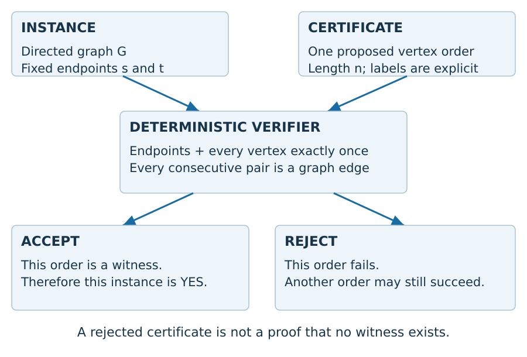

**DNAD-03-F1.** A verified certificate establishes a yes-instance. A rejected certificate only eliminates the submitted order. The distinction is the existential quantifier, not a difference in terminology.

Under an adjacency-matrix representation already in memory, a verifier can mark each visited vertex and check each successive edge. This takes \(O(n)\) word-level operations for an \(n\)-vertex candidate when indexing and labels fit the chosen word model. Reading or constructing the full matrix still costs \(\Theta(n^2)\) bits/entries at the appropriate representation level. Do not quote the verifier's inner loop as the end-to-end cost of acquiring the graph.

The reference `verify` validates its graph argument before checking the certificate, so its total Python work also includes graph normalization. Set lookup, integer representation and interpreter overhead are implementation details; our operation counts below are not measured processor timings.

## 3.3 Polynomial in which size?

An algorithm's running time is a function of the encoded input length, not merely the largest number printed in its input. A binary integer \(N\) takes approximately \(\log_2 N\) bits; performing \(N\) iterations can therefore take exponentially many iterations in that bit length. For explicitly represented simple graphs, matrix and adjacency-list encodings differ in size but can be translated with polynomial overhead. A succinct circuit describing an exponentially larger graph would define a different representation problem.

The usual class **P** contains decision problems decidable in polynomial time. **NP** can be characterized by polynomial-length certificates whose validity is checked in polynomial time. The certificate definition does not prescribe enumerating all certificates, and it does not describe a physical machine creating every possibility for free. These are the conventions used in [Sipser's lecture on P, NP and reducibility](https://ocw.mit.edu/courses/18-404j-theory-of-computation-fall-2020/45e2fd621349cfd7c9faf93a6ba134a3_MIT18_404f20_lec14.pdf).

An important negative statement follows from logic alone: the definition supplies short certificates for yes-instances. It does not automatically supply short certificates for no-instances. Negating the entire existence statement gives \(\forall P\,\neg R(G,s,t,P)\), not the rejection of one chosen \(P\). We should not confuse that distinction with a proof that no concise negative certificate could ever exist.

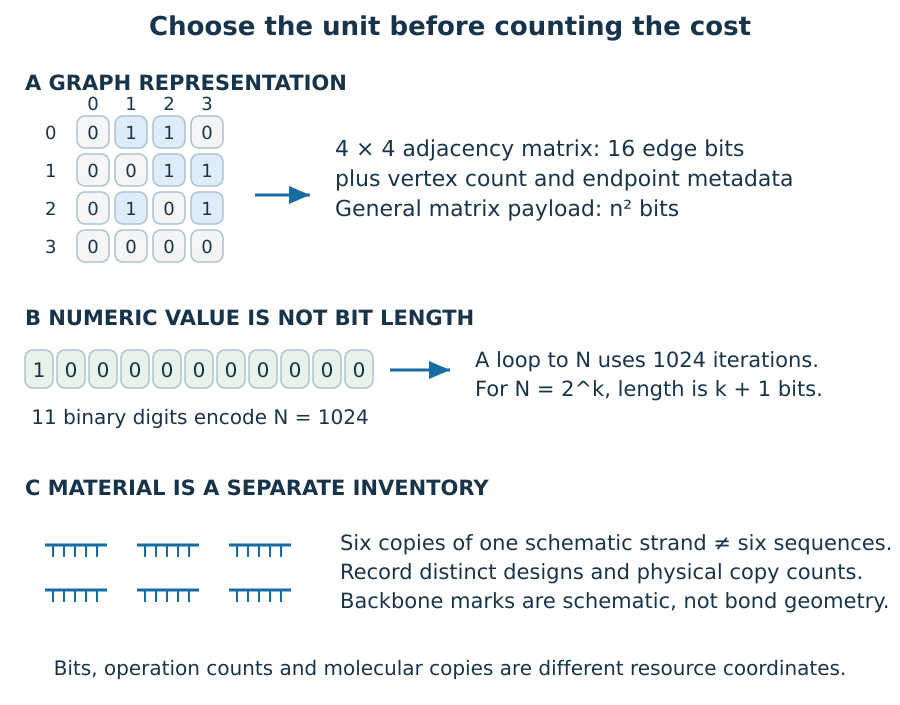

**DNAD-03-F5.** Our four-vertex matrix contains 16 adjacency bits, not 16 bits for the entire instance: the representation must also supply its size and endpoints. The integer 1024 needs 11 binary digits. Six physical copies of one sequence are six molecules but only one distinct sequence design. None of these counts can substitute for another.

Here is a precise way to read the integer example. For positive \(N\), its ordinary binary length is \(\lfloor\log_2 N\rfloor+1\). Setting \(N=2^k\) therefore makes a loop of \(N\) iterations exponential in the \(k+1\) input bits. By contrast, explicitly listing \(N\) objects already consumes at least \(N\) representation units. The same loop bound can have a different complexity interpretation because the input representation changed.

The class **coNP** is defined by complementing languages: \(L\in\mathrm{coNP}\) exactly when \(\overline L\in\mathrm{NP}\). It is not the collection of all problems outside NP. These conventions are stated in [Toronto's complexity lecture, section 4](https://www.cs.toronto.edu/~toni/Courses/Complexity2015/lectures/lecture3.pdf).

We can derive the inclusion \(P\subseteq NP\cap coNP\) without guessing which classes are equal. A deterministic polynomial-time decider is also a verifier that ignores its certificate, so \(P\subseteq NP\). Reversing the output of a deterministic decider still decides its complement in polynomial time. Thus that complement belongs to NP too, placing the original language in coNP. Reversing the answer on just one nondeterministic branch does not perform this operation on the whole existence statement.

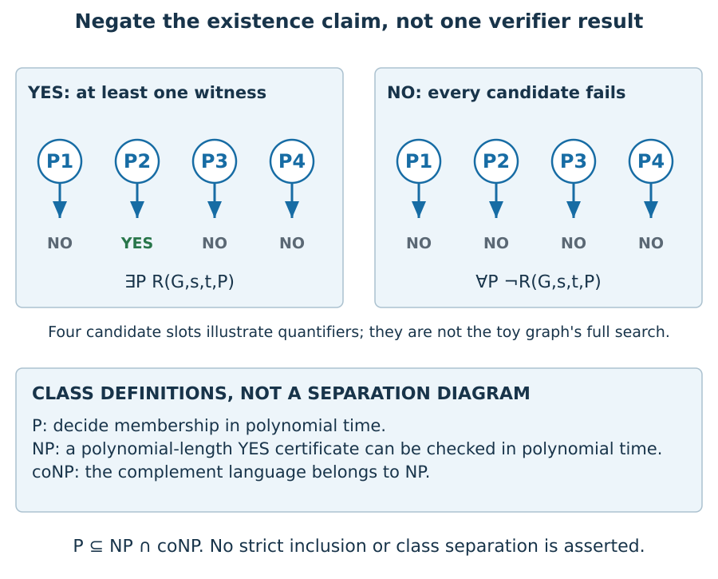

**DNAD-03-F7.** The four candidate slots are a schematic finite universe, not the exhaustive orders of our running graph. The left panel needs one accepted candidate; the right panel needs all candidates rejected. Checking only the four drawn slots would not establish a negative answer for a problem with further candidates. The class definitions below the panels do not assert strict inclusions.

## 3.4 Reuse the future question, not the entire history

Naive fixed-endpoint enumeration examines up to \((n-2)!\) interior orders. Many prefixes, however, lead to the same remaining problem. Suppose two valid prefixes have visited the same set \(S\) and both end at vertex \(v\). The remaining vertices are \(V\setminus S\), and the next step must use an outgoing edge from \(v\). Their internal orders no longer affect whether an unused suffix can complete the path.

This motivates a Boolean state:

\[
D[S,v]=\text{a simple path from }s\text{ visits exactly }S\text{ and ends at }v.
\]

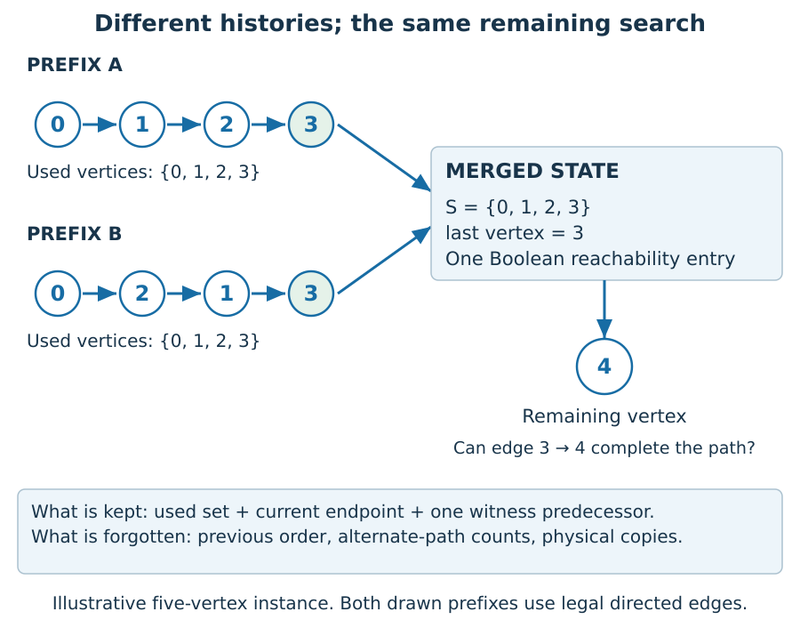

**DNAD-03-F2.** This separate five-vertex illustration exposes a state equivalence before the final step. Equal visited sets alone are insufficient: different last vertices can have different outgoing edges. Equal last vertices alone are also insufficient: different used vertices permit different future moves.

Start with \(D[\{s\},s]=\mathrm{true}\). For a reachable state and an unused neighbor \(w\), set

\[
D[S\cup\{w\},w]\leftarrow\mathrm{true}
\quad\text{if }(v,w)\in E\text{ and }w\notin S.
\]

Process sets in increasing cardinality. The invariant is proved by induction. The base state is the one-vertex path. Every transition appends one unused vertex through a permitted edge, preserving validity. Conversely, remove the last vertex from any valid longer path. Its remaining prefix is a valid smaller state, and the recurrence restores exactly that final step. Therefore \(D[V,t]\) is true if and only if a witness exists.

Our implementation additionally refuses to enter \(t\) before the set is full. This is safe because a simple path ending at \(t\) cannot leave \(t\) and later revisit it. One predecessor per reachable state is enough to reconstruct one witness. It is not enough to count all witnesses or represent their molecular multiplicities. Different questions need different state values and sometimes different state definitions.

There are at most \(n2^n\) mask/endpoint pairs. Scanning up to \(n\) outgoing neighbors for each gives an \(O(n^2 2^n)\) upper bound in the usual unit-cost subset-DP account, with \(O(n2^n)\) state storage. This is not a best-known-algorithm claim. The executable implementation uses arbitrary-precision Python bitmasks, whose operations acquire a size-dependent cost as masks exceed machine words. Both accounts remain exponential, not polynomial.

## 3.5 What the counters actually show

On the four-vertex example, the implementation creates six reachable states, arranged in cardinality layers \(1,2,2,1\), and performs ten outgoing-neighbor scans. The two full paths merge into one terminal reachability state. These counts come from [the executable result artifact](results.json), not a decorated complexity diagram.

For the complete directed graph with fixed endpoints and \(n\ge3\), our early-terminal rule permits exactly

\[
2+(n-2)2^{n-3}
\]

reachable states. To derive this, count the initial state and final state separately. Every other state chooses one of the \(n-2\) interior vertices as its last vertex, then any subset of the other \(n-3\) interior vertices as already visited. Completeness of the graph makes every such choice reachable. At \(n=8\), the result is 194 states. This is a state-count formula for this graph family and this implementation, not a general physical-resource law.

The tests compare subset search against independent permutation enumeration on **every one of the 4,096 simple directed four-vertex graphs**. This is useful fault detection. The inductive invariant is what supports correctness for arbitrary finite graph size; exhaustive testing at size four cannot replace it.

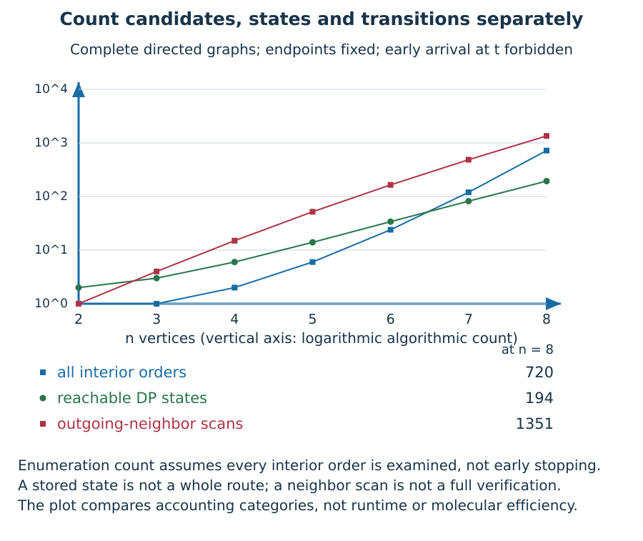

**DNAD-03-F8.** The curve uses complete directed graphs, unlike our six-edge running graph. At \(n=4\), the complete graph has 15 neighbor scans while the running graph has ten. At \(n=8\), there are 720 possible interior orders, 194 reachable states and 1,351 scans. These are generated counts, not measured execution times.

Why can scans outnumber candidate orders at this small size? A neighbor scan is an attempted local extension, including extensions rejected because the neighbor was already visited or is the terminal vertex too early. An enumerated order is a whole proposed route, which itself needs edge checks. Equating one scan with one verified order compares different units. Also, a decision-only enumerator can stop at its first witness; our permutation oracle deliberately lists every witness. The comparison describes full enumeration and state exploration, not a fair early-stopping runtime contest.

The asymptotic state reduction is nevertheless meaningful. With \(k=n-2\) interior vertices, full enumeration has \(k!\) orders while the dense reachable-state count is \(2+k2^{k-1}\). The ratio of successive factorial counts is \(k+1\), while the state count eventually grows by a factor close to two. This explains why merging histories matters at increasing sizes, without turning an exponential method into a polynomial one. Memory, transition work and reconstruction costs still require their own accounting.

## 3.6 A reduction has a direction and two implications

A polynomial many-one reduction from problem \(A\) to problem \(B\) computes a mapping \(f\) such that

\[
x\in A\iff f(x)\in B.
\]

Thus a fast solver for \(B\), composed with \(f\), would solve \(A\). Hardness travels from the source problem toward the target problem. A mapping in the reverse direction establishes a different claim.

Consider a directed Hamiltonian-cycle instance. Choose a pivot vertex, replace it by a source \(s\) and sink \(t\), redirect outgoing pivot edges from \(s\), and redirect incoming pivot edges into \(t\). Keep the other edges. A cycle through the pivot opens into a spanning \(s\)-to-\(t\) path. Conversely, identifying the endpoints of such a path closes a cycle through the original vertices. The construction adds one vertex and preserves the number of edges for our loop-free graph convention. This is the vertex-splitting reduction presented in [MIT's algorithms recitation](https://ocw.mit.edu/courses/6-046j-design-and-analysis-of-algorithms-spring-2015/1dee182d301235b901119a0ff57f05e2_MIT6_046JS15_Recitation8.pdf).

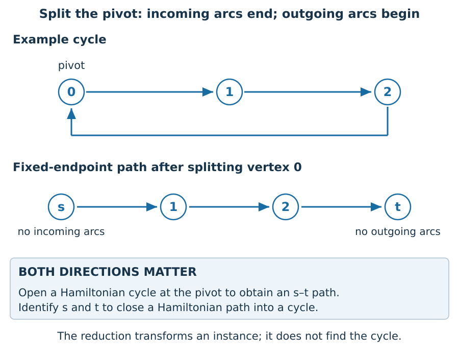

**DNAD-03-F3.** The three-cycle is an illustration, not the proof for every graph. The code checks all simple directed three-vertex graphs and every pivot, including graphs without cycles.

This argument transfers an established hardness premise for directed Hamiltonian cycle to the fixed-endpoint path problem. It does not establish that premise from scratch. A full path from satisfiability to the Hamiltonian family needs a separately reviewed construction; do not hide that missing step inside a decorative arrow.

## 3.7 Encode the whole predicate in Boolean clauses

We can also map a fixed-endpoint path instance to a satisfiability instance. This direction is useful for expressing constraints but, by itself, is not a proof that the path problem is NP-hard.

Let \(x_{v,p}\) mean that vertex \(v\) occupies position \(p\). There are \(n^2\) variables. Require exactly one vertex at each position and exactly one position for each vertex. An elementary exactly-one encoding uses one positive clause for “at least one” and a negative two-literal clause for every pair that must not both be true. Add the unit clauses \(x_{s,0}\) and \(x_{t,n-1}\). Finally, for each forbidden transition \((u,v)\notin E\) and each \(p<n-1\), add

\[
\neg x_{u,p}\lor\neg x_{v,p+1}.
\]

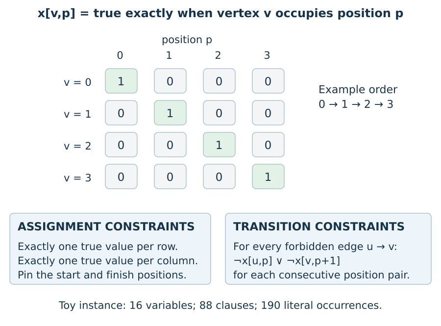

**DNAD-03-F4.** A permutation matrix can still describe a forbidden-edge route. The transition clauses implement the extra adjacency condition already exposed by Chapter 2's pseudo-path.

Soundness is direct: every satisfying assignment is a permutation matrix, and the endpoint and transition clauses turn its decoded order into a witness. Completeness is also direct: encode any valid path by putting true in its occupied vertex/position cells; every clause family is then satisfied.

Our encoding emits

\[
2n+2n\binom n2+2+(n-1)(n^2-m)
\]

clauses for a loop-free directed graph with \(m\) edges. The four terms count positive exactly-one clauses, pairwise exclusions, endpoints and forbidden transitions. Self-transitions are included among forbidden edges even though the permutation constraints already rule them out; redundancy does not invalidate the encoding. Our toy graph produces 16 variables, 88 clauses and 190 literal occurrences. Tests inspect all \(2^9\) Boolean assignments for each three-vertex graph, not just hand-picked permutation assignments. That catches encodings that accidentally admit malformed matrices.

## 3.8 Turn a decision oracle into a witness

Suppose an oracle answers the fixed-endpoint existence question. Ask it once about the original graph. If the answer is yes, consider edges one by one. Delete an edge whenever the oracle says a witness still exists without it. This maintains a yes-instance and terminates after at most \(m+1\) oracle calls.

Why does the remaining graph reveal a path? Select any spanning witness in the final graph. If an edge lay outside that witness, removing it would preserve that witness, contradicting edge minimality. Hence every remaining edge belongs to the chosen path; the final graph contains exactly its \(n-1\) edges. An edge that was indispensable when considered cannot become dispensable after further deletions: deleting more edges cannot create a missing path. This justifies a single pass over the edges.

The companion implements this reduction with `subset_search` as its oracle. That oracle is exponential; calling it “an oracle” does not remove its cost. On our six-edge toy graph, seven calls leave the witness \((0,2,1,3)\). This differs from the first witness returned by subset search, without any contradiction: the task requests a witness, not a unique canonical order.

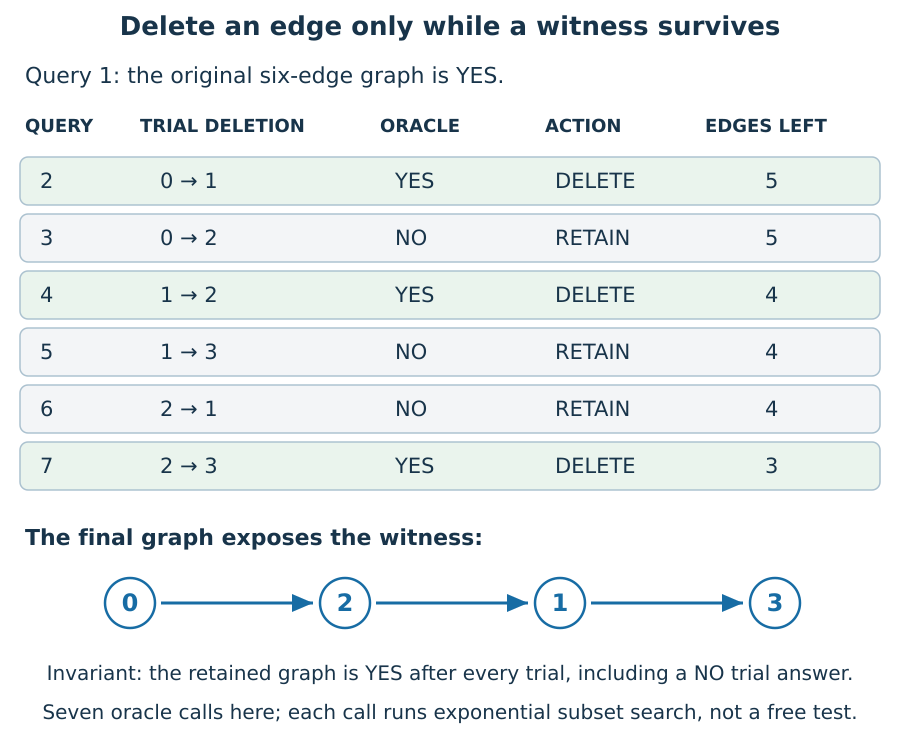

**DNAD-03-F6.** A NO answer describes the trial graph without the tested edge. It does not describe the retained graph: on NO, the algorithm keeps that edge and preserves a yes-instance. This distinction is visible at query 3, where deleting \(0\to2\) would remove the only surviving way to leave the source after \(0\to1\) has already been deleted.

We can sharpen the edge-minimality argument by naming the time dependence. Let \(G_i\) be the retained graph before testing edge \(e_i\), and let \(G_f\subseteq G_i\) be the final retained graph. If \(G_i-e_i\) has no witness, neither can its subgraph \(G_f-e_i\). Therefore a retained edge never needs to be reconsidered. If the final graph had an extra edge outside a spanning witness \(P\), that edge would contradict this fact because \(P\) would survive its deletion. This proves both the one-pass rule and the final \(n-1\)-edge structure.

The trace records the graph *after* each decision, rather than just a list of answers. Tests independently enumerate witnesses in both the trial and retained graph at each step. This catches a subtle implementation failure: printing correct oracle answers while accidentally retaining the wrong edge set.

## 3.9 Bring the accounting back to molecules

The Boolean DP can forget alternate histories because its question is existential. A molecular population cannot always be treated that way. Copy numbers affect survival and detection, and different sequences with the same abstract future role may have different physical interactions. A proposed molecular implementation of the recurrence must explain how sets and endpoints are represented, how equivalent states are recognized, and what each transition costs.

Similarly, reducing a graph to a polynomial-size formula says that the formula is not exponentially larger than the encoded graph. It does not say that solving the formula is polynomial. Putting candidate assignments into many simultaneous physical objects changes allocation and depth, not the need to account for those objects.

The next resource chapter should therefore keep total work, critical-path depth, material, memory and readout separate. No theorem in this draft turns all DNA Hamiltonian solvers into factorial algorithms, and no small-instance simulation proves asymptotic superiority over electronic computation.

## 3.10 Parallel depth is not total work

A parallel algorithm has a dependency structure. If four independent candidates
each pass through three successive abstract tests, there are twelve test
applications but only three tests on any one candidate's critical path. With
enough workers, the tests at each level can overlap. That does not remove the
other nine applications; it changes when and where they are carried out.

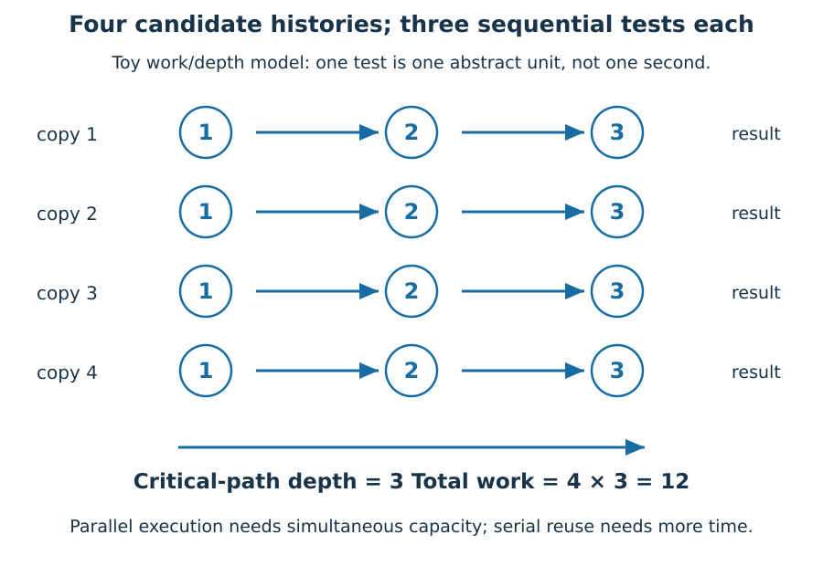

**DNAD-03-F9.** Every circle is one abstract test. Columns are dependency levels,
not laboratory time points. Work is the total number of circles; depth is the
length of the longest dependent chain. No reaction-rate calibration is implied.

Write total work as W, dependency depth as D, and available processors as P.
Under an ideal discrete model in which each operation occupies one processor
for one time unit, execution time satisfies

\[
T_P\ge\max\{W/P,D\}.
\]

The work bound follows because P processors complete at most P operations per
unit; the depth bound follows because a dependent operation cannot precede its
input. These are lower bounds, not a scheduling guarantee. Communication,
allocation, load imbalance and synchronization can increase time further.
The fixture in `completion_diagnostics.py` gives W=12 and D=3. Four ideal workers
can realize the three levels, while one worker needs at least twelve units.

A test tube is not a collection of ideal processors. Molecules interact at
concentration-dependent rates, may compete for substrates and may be lost during
handling. Thus P cannot simply be replaced by molecule count to predict a
reaction duration. The transferable lesson is the accounting separation: a
short dependency chain does not imply a small allocation, small total work or
cheap readout. Chapter 4 will add those physical coordinates rather than rename
depth as molecular speed.

## 3.11 Missing signal has several explanations

There are at least three distinct ways a positive instance can produce no
recorded witness: no witness copy enters the sample; a copy enters but does not
survive the operations; a surviving copy does not produce a recorded signal.
These alternatives concern physical completeness, not logical soundness.

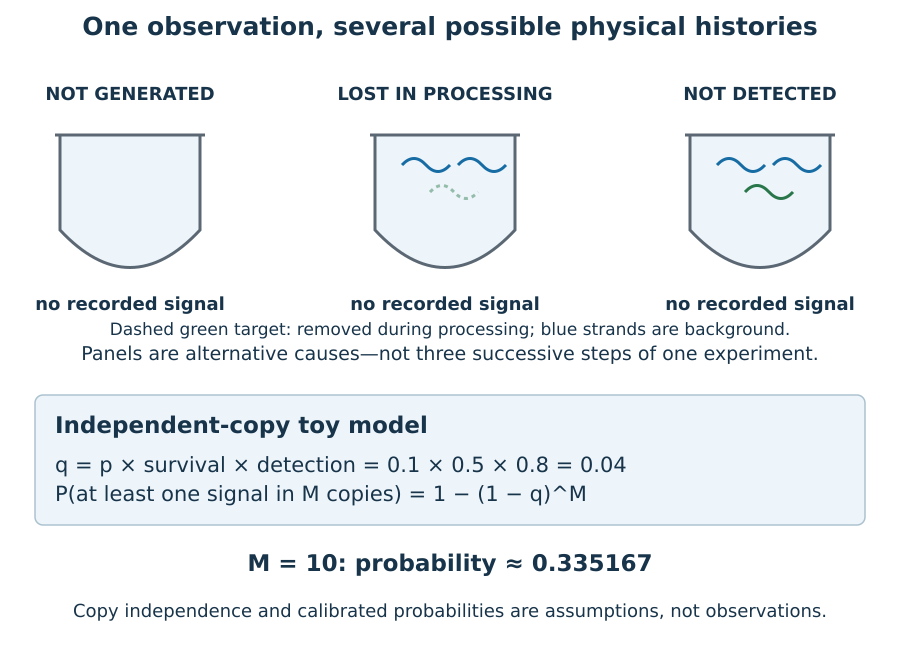

**DNAD-03-F10.** The panels are alternative explanations, not a serial protocol.
Curved marks denote schematic molecules, not counted microscopic observations.
The probability formula below them is an explicit toy model, not a fitted assay.

Suppose M independent candidate copies are drawn. Let p be the probability that
one is a witness, s the conditional probability that a witness survives, and d
the conditional probability that a surviving witness is detected. The chain
rule gives a per-copy recorded-witness probability q=psd; this factorization
uses conditional probabilities and does not require the three events within a
copy to be independent. The additional assumption is independence **across**
copies. Only then is

\[
\Pr(\text{at least one recorded witness})=1-(1-psd)^M.
\]

For p=.1, s=.5 and d=.8, q=.04. Ten copies give about .335167 probability of a
recorded witness, so no signal remains quite plausible even when a witness is
possible. The implementation uses `log1p` and `expm1` to avoid avoidable
cancellation for small q, and handles zero-copy and certain-signal boundaries
explicitly. Tests compare it with direct binomial reasoning on small cases.

Shared contamination, common reagent failure and competition can correlate
copies. In that case the exponent formula need not hold. A positive control can
show that some detection path functioned, but cannot prove all witness species
were represented or retained. Conversely, this toy model cannot turn a signal
into a valid path: that still requires decoding and the independent verifier.

## 3.12 What is proved, what is imported, what is measured

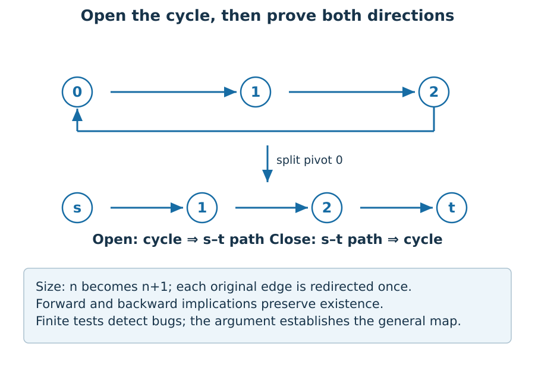

**DNAD-03-F11.** Opening and closing a cycle are inverse witness constructions
under the stated loop-free, distinct-endpoint conventions. The drawing is one
example; the argument and encoding-size account justify the general reduction.

This chapter proves its subset recurrence, path-to-CNF equivalence and
decision-to-search construction. It proves how directed cycle hardness would
transfer to the fixed-endpoint path problem. The upstream NP-hardness result is
an attributed theoretical premise, not a proof reconstructed from the original
Cook and Karp papers here. Stating that boundary is more useful than presenting
an incomplete satisfiability gadget as if its local arrows established a theorem.

Keep three evidence columns separate. A proof establishes a quantified statement
under assumptions. Finite tests challenge an implementation of that statement.
A laboratory measurement constrains a physical system and its measurement model.
None can silently replace either of the others. A theorem does not certify a
pipetting operation, and a successful reaction on one graph does not prove a
complexity-class separation.

## 3.13 The physical bridge the abstraction must preserve

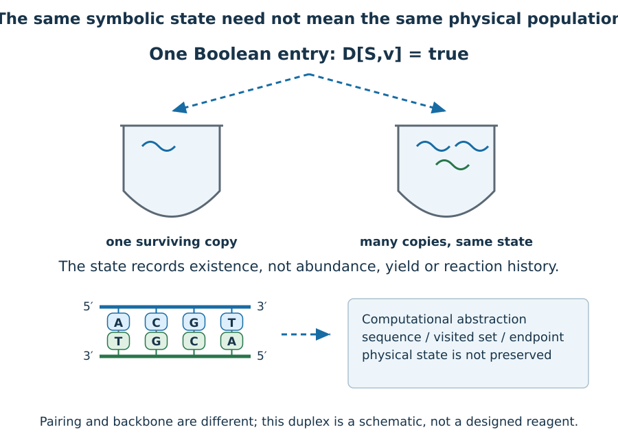

**DNAD-03-F12.** A duplex illustrates that directed sequences have a physical
realization, but the DP table is not an assay. One true Boolean entry does not
distinguish one remaining molecule from many. The cartoon's four bases illustrate
orientation; they are not a proposed stable reagent or a molecular DP design.

When two histories merge into D[S,v], the algorithm preserves the future
existence question. A proposed molecular merger must additionally preserve
whatever physical information later operations require. Sequence identity,
copy number and accessibility may affect those operations even if the abstract
visited set and endpoint match. Therefore the implementer must provide a
representation map and an error/resource contract, not just rename a molecule
as a state. This is the precise handoff to molecular parallelism and resource
accounting in Chapter 4.

## 3.14 Exercises with worked reasoning

1. **A failed certificate.** In the four-vertex example, submit \((0,1,3,2)\). Does rejection prove the instance is negative? **Solution:** It ends at 2 rather than 3 and requires absent edge \(3\to2\). This rejects that order only; either listed witness proves the instance positive.
2. **Insufficient state.** Why not store only the visited set? **Solution:** Two prefixes using the same set may end at different vertices. Their available outgoing edges differ, so they need not admit the same completion. The last vertex must be retained unless another representation supplies equivalent information.
3. **Counting witnesses.** Can the one-predecessor table count both toy witnesses? **Solution:** No. Boolean reachability merges successful histories. Counting requires a sum over predecessor counts with a base count of one. Reconstructing all paths requires still more information or traversal; its output can itself be large.
4. **Reduction direction.** Does a polynomial path-to-SAT encoding prove path hardness? **Solution:** Not by itself. It says a SAT solver can solve the encoded path problem. For a hardness transfer from SAT, a reduction must go from SAT to the claimed hard target, with both existence implications proved.
5. **Clause audit.** Explain the 88 toy clauses. **Solution:** Eight positive row/column clauses plus 48 pairwise exclusions plus two endpoint units plus \(3(16-6)=30\) transition exclusions total 88. The redundant self-transition exclusions are included in that total.
6. **Oracle budget.** Why do seven oracle calls not constitute a seven-step polynomial-time path solver? **Solution:** The calls contain substantial computations. Here each call uses an exponential subset algorithm. A polynomial number of calls to a hypothetical polynomial-time oracle would imply a polynomial-time composition, but that hypothesis has not been established.

7. **Input-size trap.** A routine takes \(N^2\) iterations on a binary integer \(N=2^k\). Is it polynomial-time in the input length? **Solution:** Its input has \(k+1\) bits, while the iteration count is \(2^{2k}\). A polynomial expression in the numeric value is not a polynomial in the encoded length.
8. **Complement closure.** Why is a problem in P also in coNP? **Solution:** Flip the output of its deterministic polynomial-time decider to decide the complement. That complement is in P and therefore NP, which is exactly the required coNP condition. No claim that NP is closed under complementation is needed.
9. **Audit the plotted graph.** Why do the two four-vertex examples report ten and fifteen scans? **Solution:** The running graph has six edges, whereas the plotted complete graph has twelve. The reachable-state count is six in both, but scanning outgoing adjacency at those states incurs different work. State count alone does not fix transition work.
10. **Trace an invariant.** After deleting \(0\to1\), why retain \(0\to2\)? **Solution:** Removing the latter leaves no outgoing edge from source 0 and hence no spanning source-to-target path. Retaining it preserves the path \(0,2,1,3\). The oracle's NO refers to the trial deletion, not to the retained graph.
11. **Design a differential test.** How would you test a trace without trusting the DP oracle? **Solution:** For every small graph, enumerate all interior permutations independently. Replay each proposed deletion, compare its existence answer with enumeration, and check that the retained graph still has a witness. Verify that the final edge set is exactly the returned path's consecutive pairs. Passing finite tests supplements, rather than replaces, the monotonicity proof.
12. **A representation audit.** An experiment advertises “only \(n\) DNA designs,” with \(2^n\) copies of each. What has the headline omitted? **Solution:** It has counted distinct designs but omitted the \(n2^n\) physical copies stipulated by its own inventory. Also request strand lengths, allocation across designs, transfer losses and detection assumptions. This is an audit of that proposal, not a lower bound on every molecular algorithm.

## Publication work still required

All twelve storyboard figures are now produced with semantic TXT companions.
The standalone Chapter 3 review edition includes a source list, glossary and
tested code appendix. It does not modify the accepted cumulative edition.
Independent subject review and cumulative LaTeX index/bibliography integration
remain release gates; the imported upstream hardness theorem is not claimed as
a newly reconstructed full proof.

## Selected glossary

**Certificate:** a proposed finite witness checked by a verifier.
**Reduction:** an efficiently computable map preserving a decision predicate.
**Work:** total elementary operations in the declared model.
**Depth:** longest chain of dependent operations in that model.
**Physical completeness:** conditions under which a logically existing witness
is represented, retained and observed; not implied by predicate soundness.
